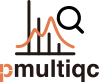

<picture>
  <source media="(prefers-color-scheme: dark)" srcset="images/pmultiqc_logo_darkbg.svg" />
  <source media="(prefers-color-scheme: light)" srcset="images/pmultiqc_logo.svg" />
  
</picture>

# pmultiqc

[](https://github.com/bigbio/pmultiqc/actions/workflows/python-app.yml)
[](https://badge.fury.io/py/pmultiqc)

**pmultiqc** is a [MultiQC](https://multiqc.info/) plugin for comprehensive quality control reporting of proteomics data. It generates interactive HTML reports with visualizations and metrics to assess the quality of mass spectrometry-based proteomics experiments.

## Key Features

- **Multi-pipeline support**: quantms, MaxQuant, DIA-NN, FragPipe, mzIdentML, ProteoBench, mhcquant
- **Interactive HTML reports**: Rich plots with hover tooltips (PCA, heatmaps, box plots, volcano plots)
- **Comprehensive QC metrics**: Identification rates, mass accuracy, retention time, charge distributions
- **Quantification methods**: LFQ, TMT/iTRAQ, DIA — tailored metrics per workflow type
- **Lightweight mode**: Disable hover info for large experiments or publication-ready reports
- **SDRF metadata**: Automatic condition/sample grouping from SDRF annotations

## Installation

```bash
pip install pmultiqc
```

## Quick Start

```bash
# quantms pipeline output
multiqc /path/to/quantms/results -o ./report

# MaxQuant output
multiqc --maxquant-plugin /path/to/maxquant/txt -o ./report

# DIA-NN output
multiqc --diann-plugin /path/to/diann/results -o ./report

# Lightweight report (no hover tooltips, smaller file)
multiqc /path/to/results --disable-hoverinfo -o ./report
```

## Supported Workflows

| Workflow | Plugin Flag | Input Files |
|----------|------------|-------------|
| quantms | `--quantms-plugin` | mzTab, MSstats, idXML, SDRF |
| MaxQuant | `--maxquant-plugin` | evidence.txt, msms.txt, proteinGroups.txt |
| DIA-NN | `--diann-plugin` | report.tsv or report.parquet |
| FragPipe | `--fragpipe-plugin` | psm.tsv, combined files |
| mzIdentML | `--mzid-plugin` | .mzid + .mzML/.mgf |
| ProteoBench | `--proteobench-plugin` | result_performance.csv |
| mhcquant | `--mhcquant-plugin` | mhcquant output files |

## Part of the quantms Ecosystem

| Tool | Description |
|------|-------------|
| [quantms](https://github.com/bigbio/quantms) | DDA proteomics Nextflow pipeline |
| [quantmsdiann](https://github.com/bigbio/quantmsdiann) | DIA proteomics pipeline |
| [mokume](https://mokume.quantms.org) | Protein quantification library |
| [qpx](https://qpx.quantms.org) | Data format conversion and QPX tools |
| [portal.quantms.org](https://portal.quantms.org) | Browse reanalyzed datasets |

## Citation

> Yue QX, Dai C, Kamatchinathan S, Bandla C, Webel H, Larrea A, Bittremieux W, Uszkoreit J, Müller TD, Xiao J, Cox J, Yu F, Ewels P, Demichev V, Kohlbacher O, Sachsenberg T, Bielow C, Bai M, Perez-Riverol Y. **pmultiqc: An open-source, lightweight, and metadata-oriented QC reporting library for MS proteomics.** *Mol Cell Proteomics.* 2026;101530. [DOI: 10.1016/j.mcpro.2026.101530](https://doi.org/10.1016/j.mcpro.2026.101530)
